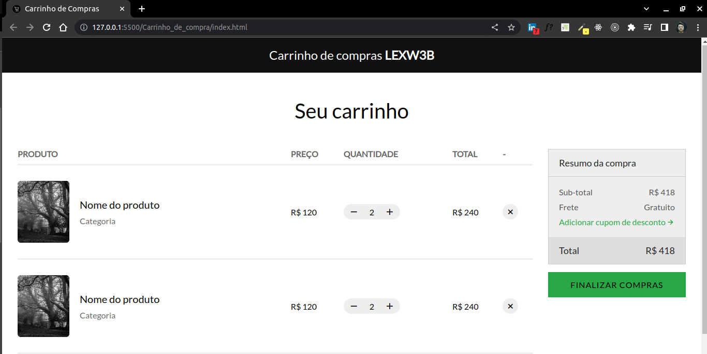

# Carrinho de compra

## Resumo

Neste projeto foi criado uma versão simplificada de uma tela de compras feita usando apenas HTML-5 semântico e estilizado com CSS-SASS (SEM FUNCIONALIDADES), em um cenário próximo ao do mercado de trabalho.

## Visualização da página
<br>
<p align="center">
  
</p>
<br>
## Tecnologias

Tecnologias e ferramentas utilizadas no desenvolvimento do projeto:

- [VS Code](https://code.visualstudio.com/)
- [JavaScript]()
- [CSS-SASS]()

<br>

## Instalação e uso

```bash
# Abra um terminal e copie este repositório com o comando
git clone git@github.com:LEXW3B/Carrinho_de_compra.git

# Entre na pasta Carrinho_de_compra
cd Carrinho_de_compra/

# Para visualizar no browser, clique dentro do arquivo index.html é insira o próximo comando:

ALT + L + O
